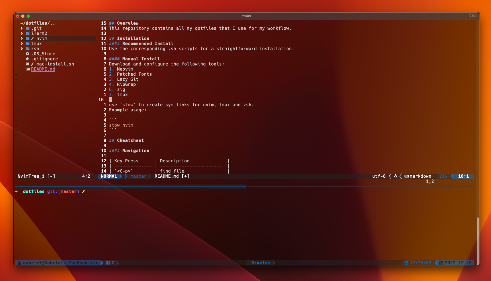

## Overview

This repository contains all my dotfiles that I use for my workflow.



## Installation

#### Recommended Install

Use the corresponding .sh scripts for a straightforward installation.

#### Manual Install

Download and configure the following tools:

1. Neovim
2. Patched Fonts
3. Lazy Git
4. RipGrep
5. zig
6. tmux

use `stow` to create sym links for nvim, tmux and zsh.
Example usage:

```
stow nvim
```

## Cheatsheet

#### Navigation

| Key Press    | Description              |
| ------------ | ------------------------ |
| `<C-p>`      | find file                |
| `<S-f>`      | find occurence in PWD    |
| `<leader>e`  | toggles file explorer    |
| `<leader>fb` | opens file buffer        |
| `<C-Arrow>`  | navigate between windows |
| `<S-Arrow>`  | split window             |

#### Workflow

| Key Press    | Description                           |
| ------------ | ------------------------------------- |
| `<leader>gd` | Go to definition                      |
| `gl`         | Go to lint                            |
| `gh`         | Hover                                 |
| `gcc`        | comment code line (normal mode)       |
| `gbc`        | block comment code line (normal mode) |
| `gb`         | block comment (visual mode)           |
| 'gc'         | line comment (visual mode)            |
| `>`          | indent (visual mode)                  |
| `<`          | remove indent (visual mode)           |
| `=`          | auto-tab (visual mode)                |
| `<leader>ca` | code action                           |

#### File explorer (Nvim-Tree)

| Key Press | Description                               |
| --------- | ----------------------------------------- |
| `a`       | create new file (trailing `/` for folder) |
| `m`       | marks file/folder                         |
| `bmv`     | move marked items                         |
| `c`       | copy file                                 |
| `p`       | pase file                                 |
| `d`       | delete file/folder                        |

#### Git

| Key Press    | Description             |
| ------------ | ----------------------- |
| `<leader>gg` | opens lazy Git          |
| `a`          | stage/unstage all       |
| `<SPACE>`    | toggle staging for file |
| `p`          | pull                    |
| `P`          | push                    |
| `c`          | commit                  |

#### Tmux

| Key Press       | Description          |
| --------------- | -------------------- |
| `<C-t>`         | prefix               |
| `<prefix>-`     | horizontal split     |
| `<prefix>`      | vertical split       |
| `<Alt-Arrow>`   | move between windows |
| `<prefix>,`     | rename window        |
| `<prefix>c`     | create window        |
| `<prefix>n`     | next window          |
| `<prefix>p`     | previous window      |
| `<prefix><C-S>` | save state           |
| `<prefix>[`     | enter copy mode      |
